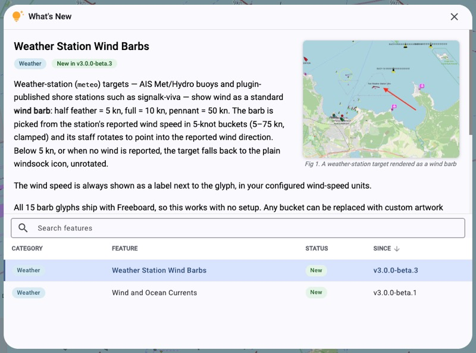

# Feature Browser & the feature corpus

The **Feature Browser** is an always-available dialog (opened from **More actions →
What's New** on the left toolbar) that lets users browse and search the app's
features — what each does, how to use it, and which release it last changed in.



It is backed by a small **feature corpus** that ships with the package, designed as a
**single source of truth with more than one consumer**. Document a feature once and it
serves:

- the **Feature Browser** (this dialog), and
- the **release-notes generator** (renders GitHub Release notes from the same ledger).

A future "What's New" indicator and an in-app help/search agent are further consumers of
the same corpus. The rule of thumb: *write the feature's documentation once, in the
corpus; never restate it in a PR body or a second place.*

## Where things live

| Path | What |
|------|------|
| `features/<id>.md` | one hand-authored doc per feature (frontmatter + Markdown body) |
| `features/changelog.json` | the append-only change ledger |
| `features/categories.json` | the canonical, ordered category list + chip colours |
| `features/assets/<featureId>-<n>.jpg` | screenshots, referenced inline by docs |
| `scripts/build-features.mjs` | bundles the above into `src/assets/features-corpus.json` (+ copies screenshots); validates categories. Runs automatically before `build:web` and `start` |
| `src/app/modules/features/feature-corpus.ts` | parses/compiles the payload (the unit-tested logic) |
| `src/app/modules/features/feature-browser-dialog.ts` | the dialog |

`src/assets/features-corpus.json` and `src/assets/features/` are **generated and
git-ignored** — never edit them; edit the `features/` sources. The build performs no
frontmatter/body parsing beyond a category check; all parsing lives in
`feature-corpus.ts` so the app and its tests share one implementation.

## Authoring a feature doc

`features/<id>.md`, where `<id>` is a stable slug (the file stem). Frontmatter holds flat
scalars only; the body is Markdown (rendered in-app via `ngx-remark`):

```markdown
---
id: ocean-currents           # matches the filename stem
title: Ocean Current Overlay # user-facing headline (not a PR title)
category: Weather            # must be one of features/categories.json
---

Current-state usage prose. Describe how the feature works **today**.
```

Frontmatter is `id`, `title`, `category` — flat scalars only, no nested YAML.
Screenshots are **not** in frontmatter; they are inline images (see below).

**One doc = one coherent capability a user would recognise and search for** (e.g. *Ocean
Current Overlay*, *Radar Overlay*) — not a whole category, and not a micro-tweak.

## Screenshots

Screenshots are **inline Markdown images** in the body — there is no frontmatter field:

```markdown

```

- **Zero or more** per feature. The **first** image is pulled out as a *lead figure*
  that floats top-right, flush with the title; any others float inline where you place
  them — put an image just before the paragraph it illustrates. All float right, with the
  prose (and the History table) wrapping down their left.
- **Caption** = the image's alt text ("Fig 1. …").
- **Files** live in `features/assets/`, named **`<featureId>-<figNumber>.jpg`** (e.g.
  `current-overlay-1.jpg`, `current-overlay-2.jpg`). Reference them by **bare filename**;
  the app resolves the path. Full `http(s)://` URLs are passed through untouched.
- **Recommended size ≈ 800×600 px JPG** (4:3) — a recommendation, not a requirement. The
  browser scales each figure to ~300 px wide, so ~800 px keeps it crisp on high-DPI
  screens; any aspect ratio works. (DPI metadata doesn't affect on-screen size — only the
  pixel dimensions do — so ignore it.)
- Clicking any screenshot opens a **viewer**; ←/→ page through the feature's images.

## Categories

The canonical list lives in **`features/categories.json`** (name + chip `hue`), and the
build **fails** if any doc uses a category not in it — so typos and drift can't slip
through. Chip colours come from that file too (deliberate per-category, not hashed).
Adding a category is a one-line edit there; the list is meant to grow when a genuinely new
area appears.

Current set:

> Charts · Waypoints · Routes · Tracks · Notes · Navigation · Autopilot · Weather · Radar
> · AIS & Vessels · Alarms & Notifications · Import/Export · Extensions · Display

**The organising principle — categorise by *area*, not *mechanism*.** A category is a
feature area a user thinks in ("I want to do something with waypoints"), never an
implementation detail. Consequences:

- **There is no "Settings" category.** A setting is a mechanism, not an area — it travels
  *with* the feature it configures. A wind-barb display option is a **Weather** feature;
  night mode is **Display**; a unit preference is **Display**. A "Settings" bucket would
  wrongly pull configuration out of the features it belongs to.
- Some near-neighbours are deliberately distinct areas:
  - **Routes / Tracks** — *managing the resource*. Routes = planning your own passage;
    Tracks = recorded history (own **and** other vessels' — a common use).
  - **Navigation** — the *act of steering* to a destination: course-to-steer, active
    destination / go-to, cross-track error, arrival. The plan/state, advisory.
  - **Autopilot** — *commanding the steering gear*: engage/standby, modes, heading nudges,
    tack. Coupled to Navigation (track mode consumes the nav target) but distinct: a
    control on the pilot is Autopilot; setting/reading the destination is Navigation.

## The change ledger

`features/changelog.json` is a JSON array with **one row per change event** (a feature ×
the PR that changed it):

```json
[
  { "feature": "radar-overlay",   "pr": 400, "kind": "new",      "since": "v2.14.0", "date": "2024-09-05", "title": "feat(radar): overlay radar returns on the chart" },
  { "feature": "current-overlay", "pr": 470, "kind": "new",      "since": "v2.28.0", "date": "2025-02-10", "title": "feat(weather): surface ocean-current vectors on the chart" },
  { "feature": "current-overlay", "pr": 523, "kind": "enhanced", "since": "v3.0.0",  "date": "2026-05-08", "title": "feat(weather): make current-overlay arrows customizable symbols" },
  { "feature": null,              "pr": 240, "kind": "skip",     "reason": "internal refactor, no user-facing change" }
]
```

| Field | Meaning |
|-------|---------|
| `feature` | the doc `id` this event concerns (`null` for a `skip`) |
| `pr` | the PR number that introduced the change |
| `kind` | `new` (feature's first appearance), `enhanced` (a change to an existing feature), or `skip` (a PR deliberately not surfaced to users) |
| `since` | the release the change shipped in — leave blank/omit on `master` until released, then set it |
| `date` | ISO date the change landed — drives the details-pane history table |
| `title` | the PR title verbatim (with its `type(scope):` prefix); the prefix is stripped for display |
| `reason` | for `skip` rows only |

The browser reads `feature`, `kind`, `since` (the newest event per feature drives its
**Status**/**Since** columns) and lists each feature's `date`/`pr`/`title` rows,
newest-first, in the details pane. `title` (prefix stripped) also feeds the release-notes
generator.

## Decisions & guidance

These are the judgement calls the model is built around — read them before authoring.

- **`kind` is derived, not declared.** It follows from whether the feature already has a
  doc/prior ledger row (`new` if not, `enhanced` if so) — **not** from the PR's
  `feat`/`fix` title prefix (which is unreliable). So a PR mistitled `feat` on an existing
  feature is still recorded `enhanced`.

- **A feature has exactly one category** — the single most appropriate *area*. Pick it
  case by case; don't split one capability across categories.

- **More than one PR per feature** is normal: a feature evolves over releases. When it
  changes, **edit its doc in place** (it describes current state) and **append** a ledger
  row. Never clone the doc.

- **More than one feature per PR** is supported (multiple rows sharing a `pr`). Prefer
  *one feature per PR* — but use it when a PR genuinely delivers two distinct user-facing
  features, or when backfilling old PRs. Note the release-notes generator emits one line
  per feature row, so a 2-feature PR appears as two changelog lines.

- **A row records a *change to* a feature, not a *use of* one** (producer vs consumer).
  Example: a PR that lets **wind-barbs** use the existing custom-symbols capability is a
  change to *wind-barbs* → a `wind-barbs` row (`enhanced`). It is **not** a change to the
  *Symbols* feature (whose code didn't change — wind-barbs just opted in) → **no** symbols
  row. This keeps each feature's history to PRs that actually changed it.

## Contract for adding an entry (no tooling required)

1. **New user-facing feature** → add `features/<id>.md` (with a valid `category`), and
   append a `{ "kind": "new", "date": "…", "title": "…" }` row.
2. **Change to an existing feature** → **edit that feature's doc**, and append a
   `{ "kind": "enhanced", "date": "…", "title": "…" }` row. Do not create a second doc.
3. **A PR with no user-facing change** → append a `{ "feature": null, "kind": "skip",
   "reason": "…" }` row.
</content>
